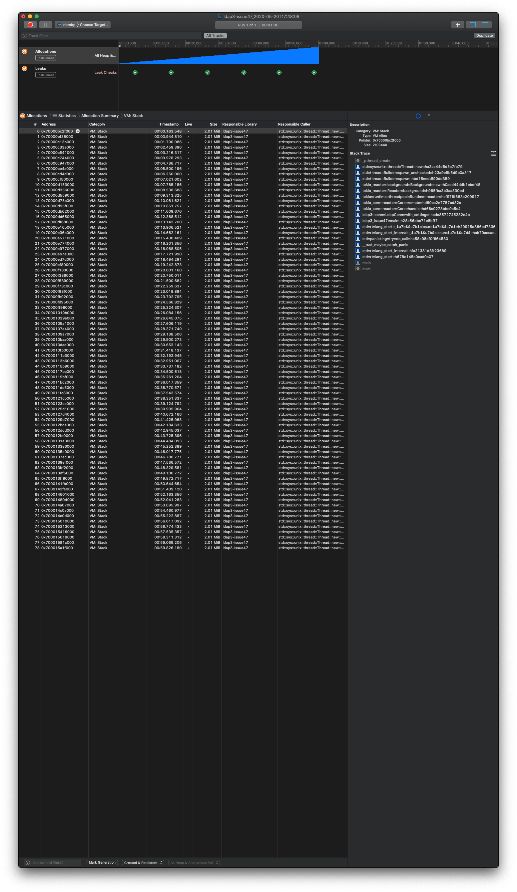

# Ldap3 Issue 47

This is a minimal working example for the Rust crate `ldap3`'s
[issue 47](https://github.com/inejge/ldap3/issues/47).

* See the [`Cargo.lock`](Cargo.lock) for the exact dependencies used.
* See the [`rust-toolchain`](rust-toolchain) for the exact Rust version used.

The problem was exposed using macOS's Instruments and
[`cargo-instruments`](https://github.com/cmyr/cargo-instruments):

```sh
cargo instruments --limit 60000 --template Leaks --open
```

[](screenshot.png)

```sh
❯ cargo tree
ldap3-issue47 v0.1.0 (/Users/nbigaouette/codes/rust/ldap3-issue47)
└── ldap3 v0.6.1
    ├── byteorder v1.3.4
    ├── bytes v0.4.12
    │   ├── byteorder v1.3.4 (*)
    │   └── iovec v0.1.4
    │       └── libc v0.2.70
    ├── futures v0.1.29
    ├── lazy_static v1.4.0
    ├── lber v0.1.6
    │   ├── byteorder v1.3.4 (*)
    │   ├── bytes v0.4.12 (*)
    │   └── nom v2.2.1
    ├── log v0.4.8
    │   └── cfg-if v0.1.10
    ├── native-tls v0.2.4
    │   ├── lazy_static v1.4.0 (*)
    │   ├── libc v0.2.70 (*)
    │   ├── security-framework v0.4.4
    │   │   ├── bitflags v1.2.1
    │   │   ├── core-foundation v0.7.0
    │   │   │   ├── core-foundation-sys v0.7.0
    │   │   │   └── libc v0.2.70 (*)
    │   │   ├── core-foundation-sys v0.7.0 (*)
    │   │   ├── libc v0.2.70 (*)
    │   │   └── security-framework-sys v0.4.3
    │   │       ├── core-foundation-sys v0.7.0 (*)
    │   │       └── libc v0.2.70 (*)
    │   ├── security-framework-sys v0.4.3 (*)
    │   └── tempfile v3.1.0
    │       ├── cfg-if v0.1.10 (*)
    │       ├── libc v0.2.70 (*)
    │       ├── rand v0.7.3
    │       │   ├── getrandom v0.1.14
    │       │   │   ├── cfg-if v0.1.10 (*)
    │       │   │   └── libc v0.2.70 (*)
    │       │   ├── libc v0.2.70 (*)
    │       │   ├── rand_chacha v0.2.2
    │       │   │   ├── ppv-lite86 v0.2.8
    │       │   │   └── rand_core v0.5.1
    │       │   │       └── getrandom v0.1.14 (*)
    │       │   └── rand_core v0.5.1 (*)
    │       │   [dev-dependencies]
    │       │   └── rand_hc v0.2.0
    │       │       └── rand_core v0.5.1 (*)
    │       └── remove_dir_all v0.5.2
    ├── nom v2.2.1 (*)
    ├── tokio-codec v0.1.2
    │   ├── bytes v0.4.12 (*)
    │   ├── futures v0.1.29 (*)
    │   └── tokio-io v0.1.13
    │       ├── bytes v0.4.12 (*)
    │       ├── futures v0.1.29 (*)
    │       └── log v0.4.8 (*)
    ├── tokio-core v0.1.17
    │   ├── bytes v0.4.12 (*)
    │   ├── futures v0.1.29 (*)
    │   ├── iovec v0.1.4 (*)
    │   ├── log v0.4.8 (*)
    │   ├── mio v0.6.22
    │   │   ├── cfg-if v0.1.10 (*)
    │   │   ├── iovec v0.1.4 (*)
    │   │   ├── libc v0.2.70 (*)
    │   │   ├── log v0.4.8 (*)
    │   │   ├── net2 v0.2.34
    │   │   │   ├── cfg-if v0.1.10 (*)
    │   │   │   └── libc v0.2.70 (*)
    │   │   └── slab v0.4.2
    │   ├── scoped-tls v0.1.2
    │   ├── tokio v0.1.22
    │   │   ├── bytes v0.4.12 (*)
    │   │   ├── futures v0.1.29 (*)
    │   │   ├── mio v0.6.22 (*)
    │   │   ├── num_cpus v1.13.0
    │   │   │   └── libc v0.2.70 (*)
    │   │   ├── tokio-codec v0.1.2 (*)
    │   │   ├── tokio-current-thread v0.1.7
    │   │   │   ├── futures v0.1.29 (*)
    │   │   │   └── tokio-executor v0.1.10
    │   │   │       ├── crossbeam-utils v0.7.2
    │   │   │       │   ├── cfg-if v0.1.10 (*)
    │   │   │       │   └── lazy_static v1.4.0 (*)
    │   │   │       │   [build-dependencies]
    │   │   │       │   └── autocfg v1.0.0
    │   │   │       └── futures v0.1.29 (*)
    │   │   ├── tokio-executor v0.1.10 (*)
    │   │   ├── tokio-fs v0.1.7
    │   │   │   ├── futures v0.1.29 (*)
    │   │   │   ├── tokio-io v0.1.13 (*)
    │   │   │   └── tokio-threadpool v0.1.18
    │   │   │       ├── crossbeam-deque v0.7.3
    │   │   │       │   ├── crossbeam-epoch v0.8.2
    │   │   │       │   │   ├── cfg-if v0.1.10 (*)
    │   │   │       │   │   ├── crossbeam-utils v0.7.2 (*)
    │   │   │       │   │   ├── lazy_static v1.4.0 (*)
    │   │   │       │   │   ├── maybe-uninit v2.0.0
    │   │   │       │   │   ├── memoffset v0.5.4
    │   │   │       │   │   │   [build-dependencies]
    │   │   │       │   │   │   └── autocfg v1.0.0 (*)
    │   │   │       │   │   └── scopeguard v1.1.0
    │   │   │       │   │   [build-dependencies]
    │   │   │       │   │   └── autocfg v1.0.0 (*)
    │   │   │       │   ├── crossbeam-utils v0.7.2 (*)
    │   │   │       │   └── maybe-uninit v2.0.0 (*)
    │   │   │       ├── crossbeam-queue v0.2.1
    │   │   │       │   ├── cfg-if v0.1.10 (*)
    │   │   │       │   └── crossbeam-utils v0.7.2 (*)
    │   │   │       ├── crossbeam-utils v0.7.2 (*)
    │   │   │       ├── futures v0.1.29 (*)
    │   │   │       ├── lazy_static v1.4.0 (*)
    │   │   │       ├── log v0.4.8 (*)
    │   │   │       ├── num_cpus v1.13.0 (*)
    │   │   │       ├── slab v0.4.2 (*)
    │   │   │       └── tokio-executor v0.1.10 (*)
    │   │   │   [dev-dependencies]
    │   │   │   └── tokio-io v0.1.13 (*)
    │   │   ├── tokio-io v0.1.13 (*)
    │   │   ├── tokio-reactor v0.1.12
    │   │   │   ├── crossbeam-utils v0.7.2 (*)
    │   │   │   ├── futures v0.1.29 (*)
    │   │   │   ├── lazy_static v1.4.0 (*)
    │   │   │   ├── log v0.4.8 (*)
    │   │   │   ├── mio v0.6.22 (*)
    │   │   │   ├── num_cpus v1.13.0 (*)
    │   │   │   ├── parking_lot v0.9.0
    │   │   │   │   ├── lock_api v0.3.4
    │   │   │   │   │   └── scopeguard v1.1.0 (*)
    │   │   │   │   └── parking_lot_core v0.6.2
    │   │   │   │       ├── cfg-if v0.1.10 (*)
    │   │   │   │       ├── libc v0.2.70 (*)
    │   │   │   │       └── smallvec v0.6.13
    │   │   │   │           └── maybe-uninit v2.0.0 (*)
    │   │   │   │       [build-dependencies]
    │   │   │   │       └── rustc_version v0.2.3
    │   │   │   │           └── semver v0.9.0
    │   │   │   │               └── semver-parser v0.7.0
    │   │   │   │   [build-dependencies]
    │   │   │   │   └── rustc_version v0.2.3 (*)
    │   │   │   ├── slab v0.4.2 (*)
    │   │   │   ├── tokio-executor v0.1.10 (*)
    │   │   │   ├── tokio-io v0.1.13 (*)
    │   │   │   └── tokio-sync v0.1.8
    │   │   │       ├── fnv v1.0.7
    │   │   │       └── futures v0.1.29 (*)
    │   │   │   [dev-dependencies]
    │   │   │   └── num_cpus v1.13.0 (*)
    │   │   ├── tokio-sync v0.1.8 (*)
    │   │   ├── tokio-tcp v0.1.4
    │   │   │   ├── bytes v0.4.12 (*)
    │   │   │   ├── futures v0.1.29 (*)
    │   │   │   ├── iovec v0.1.4 (*)
    │   │   │   ├── mio v0.6.22 (*)
    │   │   │   ├── tokio-io v0.1.13 (*)
    │   │   │   └── tokio-reactor v0.1.12 (*)
    │   │   ├── tokio-threadpool v0.1.18 (*)
    │   │   ├── tokio-timer v0.2.13
    │   │   │   ├── crossbeam-utils v0.7.2 (*)
    │   │   │   ├── futures v0.1.29 (*)
    │   │   │   ├── slab v0.4.2 (*)
    │   │   │   └── tokio-executor v0.1.10 (*)
    │   │   ├── tokio-udp v0.1.6
    │   │   │   ├── bytes v0.4.12 (*)
    │   │   │   ├── futures v0.1.29 (*)
    │   │   │   ├── log v0.4.8 (*)
    │   │   │   ├── mio v0.6.22 (*)
    │   │   │   ├── tokio-codec v0.1.2 (*)
    │   │   │   ├── tokio-io v0.1.13 (*)
    │   │   │   └── tokio-reactor v0.1.12 (*)
    │   │   └── tokio-uds v0.2.6
    │   │       ├── bytes v0.4.12 (*)
    │   │       ├── futures v0.1.29 (*)
    │   │       ├── iovec v0.1.4 (*)
    │   │       ├── libc v0.2.70 (*)
    │   │       ├── log v0.4.8 (*)
    │   │       ├── mio v0.6.22 (*)
    │   │       ├── mio-uds v0.6.8
    │   │       │   ├── iovec v0.1.4 (*)
    │   │       │   ├── libc v0.2.70 (*)
    │   │       │   └── mio v0.6.22 (*)
    │   │       ├── tokio-codec v0.1.2 (*)
    │   │       ├── tokio-io v0.1.13 (*)
    │   │       └── tokio-reactor v0.1.12 (*)
    │   │   [dev-dependencies]
    │   │   └── num_cpus v1.13.0 (*)
    │   ├── tokio-executor v0.1.10 (*)
    │   ├── tokio-io v0.1.13 (*)
    │   ├── tokio-reactor v0.1.12 (*)
    │   └── tokio-timer v0.2.13 (*)
    ├── tokio-io v0.1.13 (*)
    ├── tokio-proto v0.1.1
    │   ├── futures v0.1.29 (*)
    │   ├── log v0.3.9
    │   │   └── log v0.4.8 (*)
    │   ├── net2 v0.2.34 (*)
    │   ├── rand v0.3.23
    │   │   ├── libc v0.2.70 (*)
    │   │   └── rand v0.4.6
    │   │       └── libc v0.2.70 (*)
    │   ├── slab v0.3.0
    │   ├── smallvec v0.2.1
    │   ├── take v0.1.0
    │   ├── tokio-core v0.1.17 (*)
    │   ├── tokio-io v0.1.13 (*)
    │   └── tokio-service v0.1.0
    │       └── futures v0.1.29 (*)
    ├── tokio-service v0.1.0 (*)
    ├── tokio-tls v0.2.1
    │   ├── futures v0.1.29 (*)
    │   ├── native-tls v0.2.4 (*)
    │   └── tokio-io v0.1.13 (*)
    ├── tokio-uds v0.1.7
    │   ├── bytes v0.4.12 (*)
    │   ├── futures v0.1.29 (*)
    │   ├── iovec v0.1.4 (*)
    │   ├── libc v0.2.70 (*)
    │   ├── log v0.3.9 (*)
    │   ├── mio v0.6.22 (*)
    │   ├── mio-uds v0.6.8 (*)
    │   ├── tokio-core v0.1.17 (*)
    │   └── tokio-io v0.1.13 (*)
    ├── tokio-uds-proto v0.1.1
    │   ├── futures v0.1.29 (*)
    │   ├── tokio-core v0.1.17 (*)
    │   ├── tokio-proto v0.1.1 (*)
    │   ├── tokio-service v0.1.0 (*)
    │   └── tokio-uds v0.1.7 (*)
    └── url v1.7.2
        ├── idna v0.1.5
        │   ├── matches v0.1.8
        │   ├── unicode-bidi v0.3.4
        │   │   └── matches v0.1.8 (*)
        │   └── unicode-normalization v0.1.12
        │       └── smallvec v1.4.0
        ├── matches v0.1.8 (*)
        └── percent-encoding v1.0.1
```

